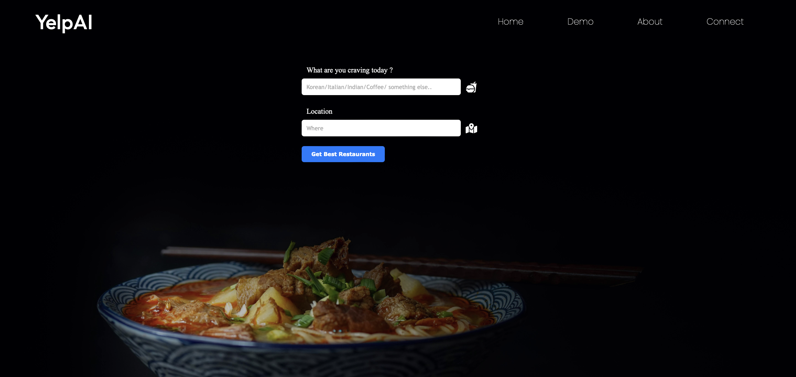

# Purpose 

YelpAI is an intelligent chatbot designed to simplify the process of finding the perfect restaurant. It looks at what kind of food you like and where you are, then finds the best places on Yelp. The best part? It can also answer questions about those restaurants by reading their reviews. So, instead of spending lots of time reading reviews yourself, YelpAI does the work for you! Our goal is to make finding and learning about restaurants quick and easy, so you can spend less time searching and more time enjoying delicious meals.

### YelpAI Tool Stack

YelpAI is built using a combination of powerful tools:

- **Yelp Fusion API**: This API provides access to a wealth of data related to businesses, allowing YelpAI to gather information about the restaurants it recommends.

- **OpenAI API**: OpenAI's language model, GPT-4, is at the core of YelpAI's chatbot functionality. It processes and analyzes text data to provide insightful responses to user queries.

- **LangChain**: LangChain acts as a bridge between Yelp Fusion and OpenAI API. It prepares and formats the retrieved data from Yelp Fusion to be fed into the OpenAI language model.

Together, these tools enable YelpAI to deliver efficient restaurant recommendations and answer user queries effectively.

### YelpAI Chatbot Features

YelpAI offers a range of features to enhance the restaurant discovery and exploration experience:

1. **Restaurant Discovery**:
   - Find the best and newest restaurants based on location and food type.

2. **Restaurant Chatbot**:
   - Engage in a chatbot conversation about a specific restaurant to get detailed information:
     - Reviews: Access recent, best, and negative reviews to get insights into the restaurant's reputation.
     - Menu: Browse through the restaurant's menu to explore available dishes.
     - Address: Obtain the address to easily locate the restaurant.
     - Phone: Access the restaurant's contact number for inquiries or reservations.
     - Hours of Operation: Check the restaurant's opening and closing hours.
     - Price: Get an idea of the price range for dining at the restaurant.

### Tech Stack 🤖

YelpAI is built using the following technology stack:

- **Python**: Powering the backend logic and server-side functionality.
  - **Flask**: A lightweight and flexible microframework for building web applications.

- **React + Vite**: Enabling a fast and modern frontend development experience.

### Demo Video 📹

Check out our demo video to see YelpAI in action!

